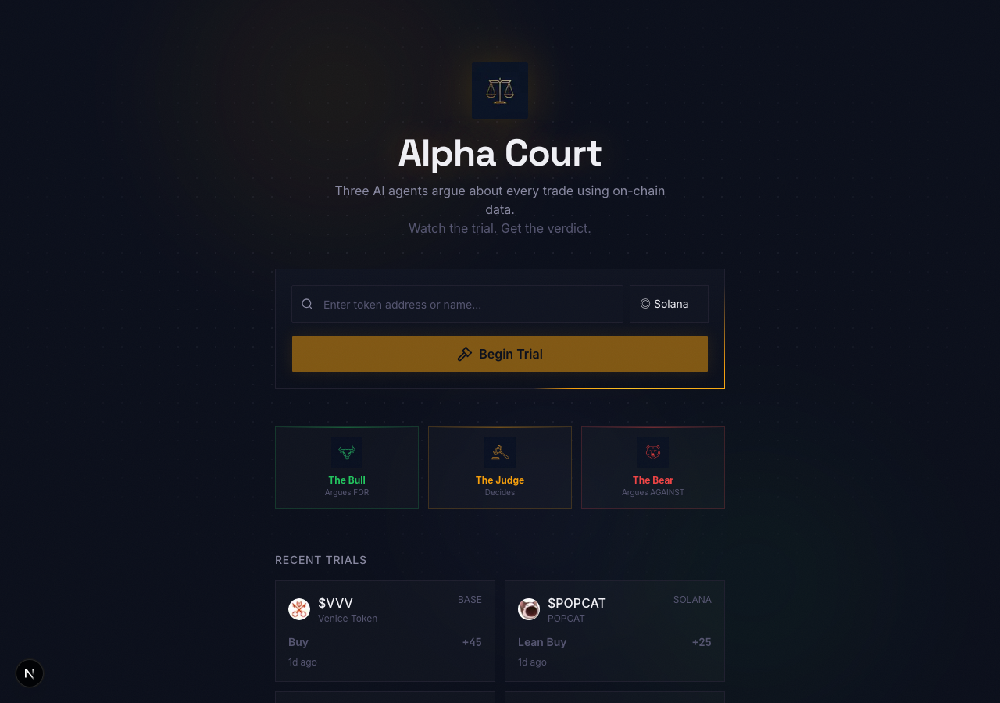
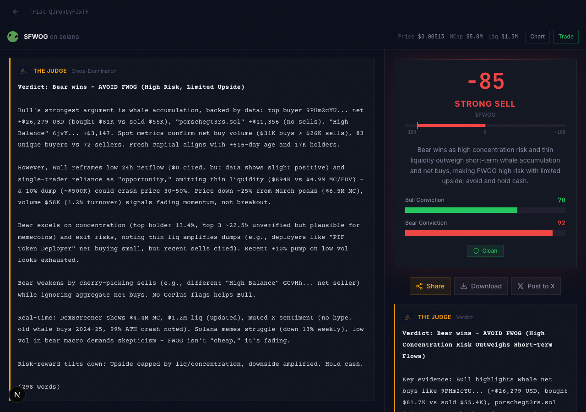
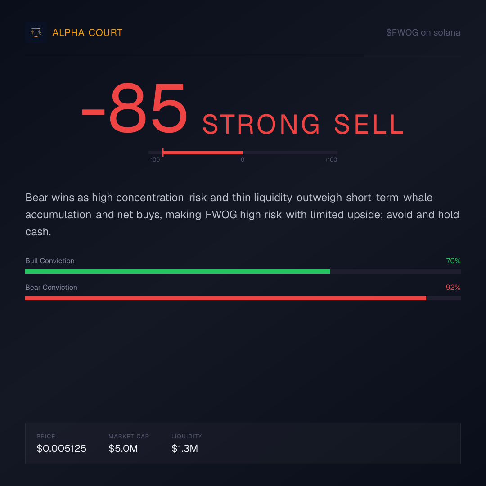

# Alpha Court — AI Agents Debate Your Trades

> *"I don't trust one AI. I don't trust one signal. So I built a courtroom where 3 AI analysts argue about every trade — and I watch the trial."*

Three AI agents — **The Bull**, **The Bear**, and **The Judge** — debate whether to buy a crypto token in real-time, each powered by different on-chain data from the **Nansen CLI**. Paste a token address, watch the trial unfold with real data citations, get a verdict, and share it.



## How It Works

1. **Paste a token** — Solana, Base, or Ethereum address (with autocomplete via Nansen search)
2. **Data gathering** — All 3 agents fetch on-chain data in parallel (14 Nansen CLI endpoints + supplementary sources)
3. **Opening statements** — Bull argues FOR, Bear argues AGAINST, both citing real data
4. **Rebuttals** — Each agent responds to the other's case
5. **Cross-examination** — The Judge questions both sides, cross-referencing claims with X/Twitter search and web search
6. **Verdict** — The Judge scores from -100 (Strong Sell) to +100 (Strong Buy) with conviction meters

The entire debate streams live via SSE. Verdicts are shareable as OG image cards on Twitter.



<p align="center"><strong>Shareable verdict card (auto-generated)</strong></p>
<p align="center"></p>

## Nansen CLI Integration (14 Endpoints)

### The Bull (argues FOR)
| # | Endpoint | What it reveals |
|---|----------|-----------------|
| 1 | `smart-money netflow` | Smart money net capital flow direction |
| 2 | `token who-bought-sold` (buy side) | Recent smart money buyers |
| 3 | `token flow-intelligence` | Capital flow by entity label (whales, millionaires, etc.) |
| 4 | `profiler pnl-summary` (buyers) | Win rate and realized PnL of top buying wallets |

### The Bear (argues AGAINST)
| # | Endpoint | What it reveals |
|---|----------|-----------------|
| 5 | `token dex-trades` | DEX sell pressure and volume |
| 6 | `token holders` | Holder concentration risk |
| 7 | `smart-money dex-trades` | Smart money selling activity |
| 8 | `token flows --label whale` | Whale exit patterns |

### The Judge (decides)
| # | Endpoint | What it reveals |
|---|----------|-----------------|
| 9 | `token info` | Token metadata (market cap, supply, age) |
| 10 | `token ohlcv` | 7-day price history and trends |
| 11 | `token who-bought-sold` (sell side) | Recent sellers |
| 12 | `profiler pnl-summary` (sellers) | Top seller PnL |

### Token Search
| # | Endpoint | What it reveals |
|---|----------|-----------------|
| 13 | `research search` | Token autocomplete on landing page |
| 14 | `research token-info` | Token metadata for search results |

### Supplementary Data Sources (shared by Bull & Bear)
- **DexScreener** — DEX price, volume, liquidity, FDV
- **Jupiter API** — Real-time Solana token prices
- **GoPlus Security** — On-chain safety flags (freeze authority, hidden fees, mintable, etc.)

Both the Bull and Bear receive all supplementary data so they argue from the same facts — the debate is about interpretation, not information asymmetry.

## Tech Stack

| Layer | Technology |
|-------|-----------|
| Framework | Next.js (App Router), TypeScript, React 19 |
| Styling | Tailwind CSS v4, shadcn/ui, custom dark courtroom theme |
| AI Models | Grok 4 via Vercel AI SDK (`ai` + `@ai-sdk/xai`) |
| AI Tools | Judge uses `x_search` + `web_search` for real-time sentiment verification |
| Primary Data | Nansen CLI (14 endpoints, cached, with concurrency limiter + retry) |
| Database | SQLite via better-sqlite3 (WAL mode) |
| Streaming | Server-Sent Events (SSE) via ReadableStream |
| OG Images | `next/og` ImageResponse for shareable verdict cards |
| Testing | Vitest |

## Architecture

```
User pastes token address
         |
         v
  POST /api/trial  (validate, create DB record)
         |
         v
  GET /api/debate/:id  (SSE stream)
         |
         v
  ┌──────────────────────────────────────────────┐
  │            Debate Engine                      │
  │                                               │
  │  Phase 1: DATA GATHERING (parallel)           │
  │    Bull: 4 Nansen + DexScreener + Jupiter     │
  │          + GoPlus                             │
  │    Bear: 4 Nansen + DexScreener + GoPlus      │
  │          + Jupiter                            │
  │    Judge: 4 Nansen endpoints                  │
  │    (max 6 concurrent CLI calls)               │
  │                                               │
  │  Phase 2: OPENING STATEMENTS (parallel)       │
  │    Bull & Bear stream arguments (~300 words)  │
  │                                               │
  │  Phase 3: REBUTTALS (sequential)              │
  │    Bear rebuts Bull, Bull rebuts Bear          │
  │                                               │
  │  Phase 4: CROSS-EXAMINATION                   │
  │    Judge questions both + web/X verification   │
  │                                               │
  │  Phase 5: VERDICT                             │
  │    Score: -100 to +100                        │
  │    Label: Strong Sell → Strong Buy            │
  │    Bull & Bear conviction meters              │
  └──────────────────────────────────────────────┘
         |
         v
  /verdict/:id  (shareable page + OG image)
```

## API for Agents (x402)

Alpha Court exposes a pay-per-use API via the [x402 protocol](https://x402.org). AI agents can analyze any token by making a single USDC micropayment — no API keys or subscriptions needed.

| Endpoint | Method | Cost |
|----------|--------|------|
| `/api/trial` | POST | $1.00 USDC |
| `/api/debate/{id}` | GET | Free |
| `/api/verdict/{id}` | GET | Free |
| `/api/trials` | GET | Free |
| `/api/token/search` | GET | Free |

**Agent discovery:** `GET /.well-known/x402` returns a machine-readable JSON describing all endpoints, pricing, and payment configuration.

**Full documentation:** See `/api-docs` for integration examples and SSE event schemas.

Configure x402 via environment variables — see `.env.example` for all options.

## Getting Started

### Prerequisites

- Node.js 20+
- [Nansen CLI](https://docs.nansen.ai/cli) installed and authenticated
- xAI API key (for Grok models)

### Setup

```bash
# Install dependencies
pnpm install

# Configure environment
cp .env.example .env.local
# Edit .env.local:
#   XAI_API_KEY=your-xai-api-key
#   NEXT_PUBLIC_APP_URL=http://localhost:3000  (optional)

# Run development server
pnpm dev
```

Open [http://localhost:3100](http://localhost:3100) and put a token on trial.

### Build for Production

```bash
pnpm build
pnpm start
```

---

Built for the **#NansenCLI Mac Mini Challenge** — Week 4 (Final Round)
